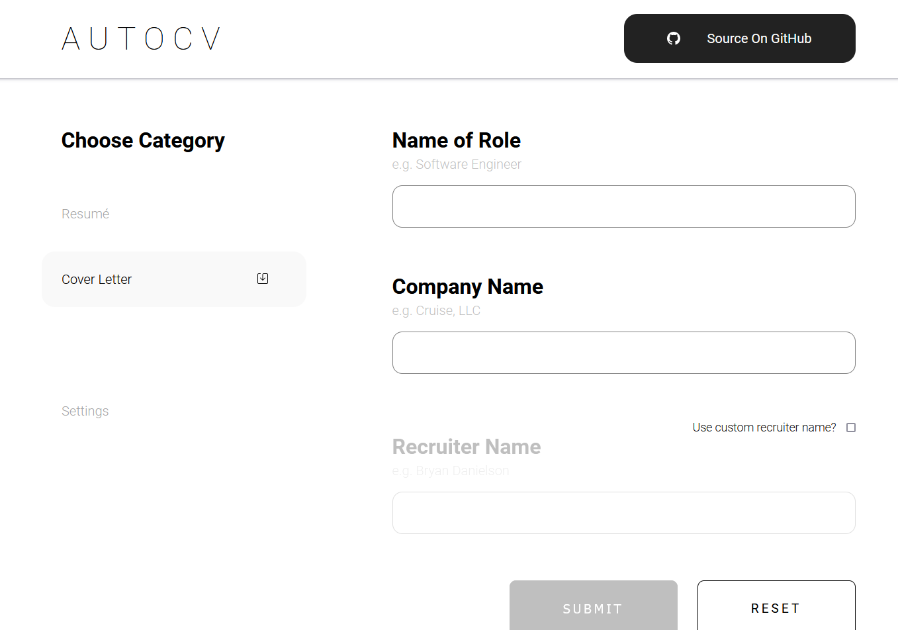

# AutoCV


All-in-one purpose-built resume and cover letter generator and automation tool, designed for Windows.

## Description
AutoCV is a full-stack web application built with [Vue.js](https://vuejs.org), [Typescript](https://typescriptlang.org) and [Flask](https://flask.palletsprojects.com/) to automate the process of modifying and uploading various different resumes and cover letters for different job applications. The app uses a number of templated fields in set of resumes and cover letter files on the backend, and the user can modify the contents of these fields from the frontend across several configurable options. Finally, the user can submit these changes and leverage the [GitHub REST API](https://docs.github.com/en/rest) for automatically converting these files to PDFs, uploading them to a file storage repository, and downloading them directly from the convenience of the browser.

## Local Development
The app can be built and run separately, or using the included Docker build staging.

### Running the frontend separarely
Using NPM
```
npm run dev
```

Using yarn
```
yarn run dev
```

### Running the backend separately
The app uses a `Python` wrapper around the GitHub REST API ([pygithub](https://github.com/PyGithub/PyGithub)) - the library is initialized with a `Personal Access Token` (steps for generating this token can be found [here](https://docs.github.com/en/authentication/keeping-your-account-and-data-secure/creating-a-personal-access-token)), and the token is read from the backend through the `GITHUB_TOKEN` environment variable. 

*NOTE: Although the app is built for Windows, the backend can at least be **initialized** on OSX and \*nix systems.*

See more about setting up the backend [here](./src/backend/README.md).

#### Windows environment setup
```
set GITHUB_TOKEN=INSERT_YOUR_PERSONAL_ACCESS_TOKEN_HERE
python server.py
```

#### OSX/Linux environment setup
```
export GITHUB_TOKEN=INSERT_YOUR_PERSONAL_ACCESS_TOKEN_HERE
python server.py
```

OR

```
GITHUB_TOKEN=INSERT_YOUR_PERSONAL_ACCESS_TOKEN_HERE python server.py
```

### Docker staging

#### Building frontend and backend images
```
docker-compose build
```

#### Running Docker images
```
docker-compose up --remove-orphans
```

## Cross Platform
A [cross platform implementation of this project](https://github.com/RunItBack/autocv-unix) has been developed that leverages LibreOffice instead of Microsoft Word, at a *significant* performance advantage, and has been tested and works on Windows, MacOS, and Linux.
